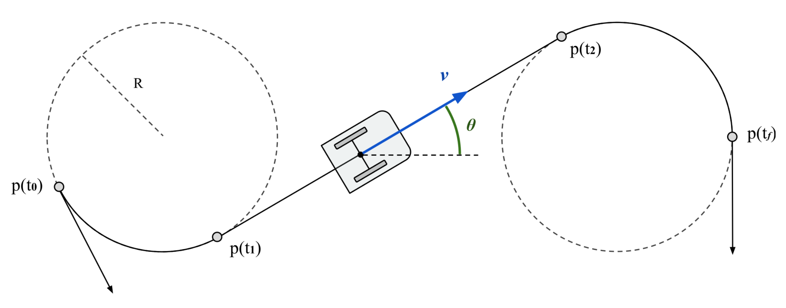
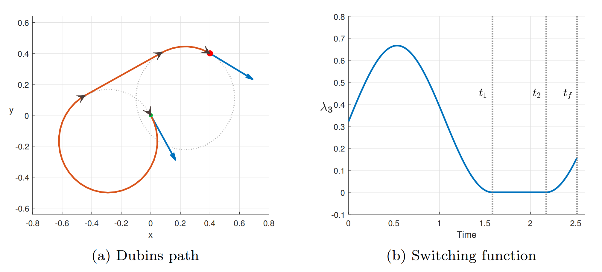

## Markov-Dubins Problem: an Optimal Control Approach

Author: Giuseppe Sensolini Arrà, *Sapienza University of Rome*.\
Technical report can be found [here](Markov-Dubins_problem_an_optimal_control_approach.pdf).

The aim of this report is to discuss and revisit some well known results of the Dubins theory from an optimal control point of view. Optimal solutions are found by means of Pontryagin Maximum principle; the rest of the work is focused on the characterization of singular and nonsingular solutions. Matlab simulations conclude the report.

